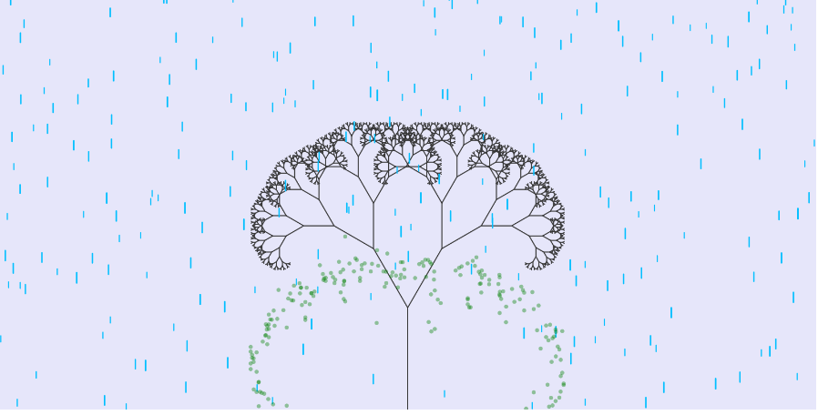

# RainingFractalTree

This uses vanilla javascript to create a beautiful animation representing rainfall and trees shedding its leaf.
NO images have been used just pure code to beautifully describe the scene.

## Snapshot of RainingFractalTree

